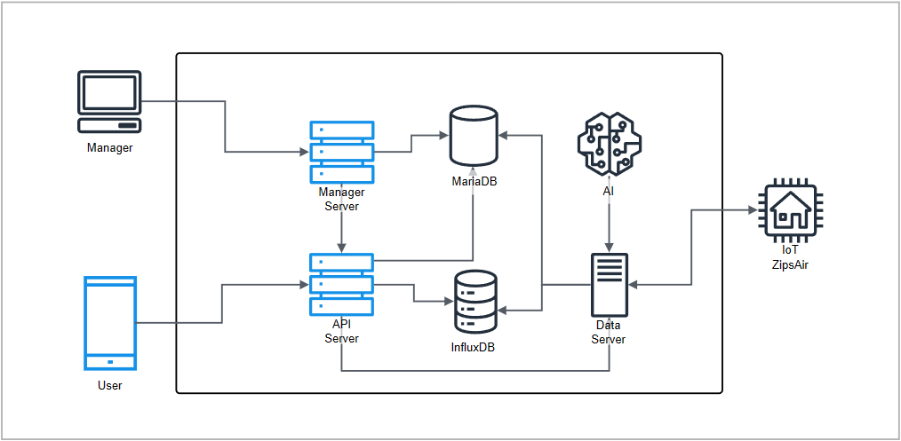

# ZIPS AI

### 스마트홈 월패드 모바일 연동 시스템 구축

실시간 모니터링 및 원격 제어를 위한 모바일 애플리케이션 · 서버 개발

 

 

 

---

## 📌 Overview

자사 스마트홈 월패드와 연동하여 사용자가 모바일 환경에서 실시간 상태를 확인하고 원격 제어할 수 있도록 Android, iOS 애플리케이션과 백엔드 서버를 구축하는 프로젝트

## ✨ Features

* 월패드 상태 실시간 모니터링
* 모바일 기반 원격 제어
* 실시간 사용자 위치 데이터 수집 및 저장
* 관리자용 백오피스 시스템 구축
* Android / iOS 통합 서비스 제공

## 🏗 Architecture

  

## ⚙ Tech Stack

| Category | Stack                                 |
| -------- | ------------------------------------- |
| Backend  | Node.js, JavaScript, SpringBoot, Java |
| Mobile   | Flutter, Kotlin, Swift                |
| Database | MariaDB, InfluxDB, MongoDB            |
| Infra    | Docker Container                      |

## 🛠 My Role

* 서비스 요구사항 분석 및 시스템 설계
* 클라이언트 · 서버 통합 아키텍처 설계
* IoT 제품 - 모바일 연동 시나리오 설계
* Node.js, SpringBoot 기반 RESTful API 개발
* MariaDB, InfluxDB, MongoDB 데이터 모델 설계
* Mobile Application 개발
* 관리자 시스템 개발

## 🔄 System Flow

#### 1. Device Monitoring

월패드 상태 정보 수집 및 실시간 동기화

#### 2. Data Processing

사용자 및 장비 데이터를 가공하여 서비스 로직 처리

#### 3. Mobile Service

Android / iOS 애플리케이션을 통한 상태 조회 및 제어

#### 4. Remote Control

실내 온도 조절기 원격 제어

#### 5. Management

관리자 시스템을 통한 운영 및 모니터링

## 🚀 Technical Highlights

#### 대규모 데이터 전송 최적화

모바일 클라이언트의 데이터 전송 방식을 개선하여
불필요한 API 호출을 최소화하고 벌크 전송 방식을 적용

이를 통해 서버 요청 수를 감소시키고
전체 서버 트래픽을 약 70% 절감

동시에 모바일 단말의 네트워크 사용량을 줄여
배터리 소모량 약 20% 감소

 

#### 레거시 시스템 구조 개선

기존 레거시 코드의 높은 결합도와 유지보수 문제를 해결하기 위해
MVC 패턴 기반 구조로 리팩토링 수행

관심사 분리를 통해 코드 가독성 및 유지보수성을 향상하고
기능 확장 시 개발 효율성을 개선

 

#### 위치 기반 서비스 설계

사용자 위치 데이터를 수집·처리하는 시스템을 설계 및 구현하여
위치 기반 서비스 기능 제공

서비스 요구사항에 맞춘 데이터 처리 구조를 구축하고
안정적인 위치 정보 관리 체계를 확보

 

#### 크로스 플랫폼 전환

기존 Android / iOS 개별 애플리케이션을 Flutter 기반으로 통합

플랫폼 간 코드 중복을 제거하고
유지보수 비용을 절감

또한 Kotlin, Swift 기반 네이티브 백그라운드 서비스를 구현하여
플랫폼별 기능 요구사항 대응

 

#### 시스템 보안 강화

서비스 전반의 보안 취약점을 분석하고
잠재적인 위험 요소를 식별

인증 및 시스템 구조를 개선하여
보안성을 강화하고 운영 안정성을 향상

 

## 📈 Results

* 모바일 애플리케이션 Android / iOS 서비스 구축
* 서버 트래픽 약 70% 절감
* 모바일 앱 배터리 소모량 약 20% 감소
* Flutter 기반 통합 개발 환경 구축
* 시스템 보안성 및 유지보수성 향상

